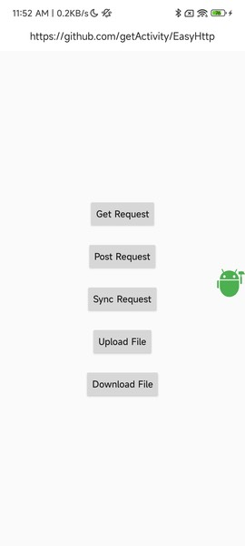
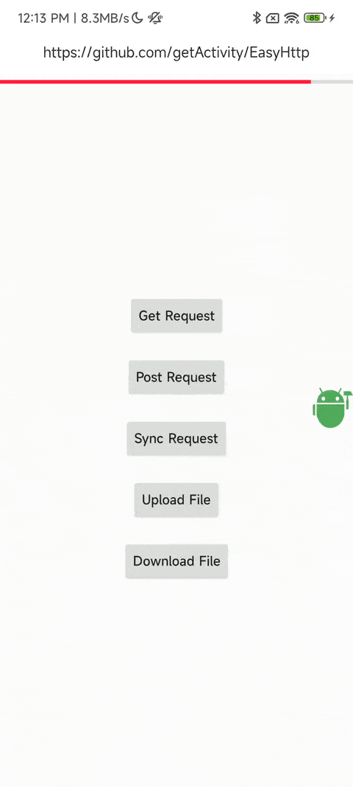

# [中文文档](README.md)

# Simple and Easy-to-Use Network Framework

* Project address: [Github](https://github.com/getActivity/EasyHttp)

* Blog address: [Network Requests, As Elegant As Silk](https://www.jianshu.com/p/93cd59dec002)

* [Click here to download demo apk directly](https://github.com/getActivity/EasyHttp/releases/download/13.0/EasyHttp.apk)





#### Integration Steps

* If your project's Gradle configuration is `7.0 or below`, you need to add the following to your `build.gradle` file:

```groovy
allprojects {
    repositories {
        // JitPack remote repository: https://jitpack.io
        maven { url 'https://jitpack.io' }
    }
}
```

* If your Gradle configuration is `7.0 or above`, you need to add the following to your `settings.gradle` file:

```groovy
dependencyResolutionManagement {
    repositories {
        // JitPack remote repository: https://jitpack.io
        maven { url 'https://jitpack.io' }
    }
}
```

* After configuring the remote repository, add the remote dependency in the `build.gradle` file under the app module:

```groovy
android {
    // Support JDK 1.8
    compileOptions {
        targetCompatibility JavaVersion.VERSION_1_8
        sourceCompatibility JavaVersion.VERSION_1_8
    }
}

dependencies {
    // Network request framework: https://github.com/getActivity/EasyHttp
    implementation 'com.github.getActivity:EasyHttp:13.0'
    // OkHttp framework: https://github.com/square/okhttp
    // noinspection GradleDependency
    implementation 'com.squareup.okhttp3:okhttp:3.12.13'
}
```

* Note: Due to the use of Lifecycle features, the framework currently only supports integration with AndroidX projects.

#### ProGuard Rules

* Do not obfuscate Bean classes under a certain package:

```text
# You must add this rule, otherwise fields in Bean classes may not be parsed correctly from backend responses. Replace xxx with the corresponding package name.
-keep class com.xxx.xxx.xxx.xxx.** {
    <fields>;
}
```

* The above ProGuard rules can be added to the `proguard-rules.pro` file in the main module.

## [For detailed usage of the framework, please click here](HelpDoc.md)

### Comparison of Different Network Request Frameworks

|  Feature or Detail  | [EasyHttp](https://github.com/getActivity/EasyHttp) | [Retrofit](https://github.com/square/retrofit)  | [OkGo](https://github.com/jeasonlzy/okhttp-OkGo) |
| :----: | :------: |  :-----: |  :-----: |
|    Supported Version  |  13.0 |  2.9.0  |  3.0.4    |
|    Number of issues   |  [](https://github.com/getActivity/EasyHttp/issues)  |  [](https://github.com/square/retrofit/issues)  |  [](https://github.com/jeasonlzy/okhttp-OkGo/issues)  |
|    **aar package size**  |  96 KB  | 123 KB  |  131 KB  |
|    minSdk requirement  |  API 14+ |  API 21+  |  API 14+   |
|    Multi-domain configuration  |  ✅  |  ❌  |   ✅   |
|    **Dynamic Host**  |  ✅  |  ❌  |   ❌   |
|    Global parameters   |  ✅  |  ❌  |    ✅   |
|    Log printing   |  ✅  |  ❌  |    ✅   |
|    Timeout retry   |  ✅  |  ✅  |    ✅   |
|    **Http cache configuration**   |  ✅  |  ❌  |    ✅   |
|    **File download verification**   |  ✅  |  ❌  |   ❌  |
|    **High-speed download**   |  ✅  |  ❌  |   ❌  |
|    **Breakpoint resume download**   |  ✅  |  ❌  |   ✅  |
|    Upload progress listener   |  ✅  |   ❌   |    ✅    |
|    Json parameter submission  |  ✅  |   ❌   |    ✅   |
|    Json log formatting  |  ✅  |   ❌   |    ❌   |
|    **Request code positioning**   |  ✅  |   ❌   |    ❌    |
|    **Delayed request initiation**   |  ✅  |   ❌   |    ❌    |
|    **Partitioned storage adaptation**   |  ✅  |   ❌   |    ❌    |
|    File upload types   | File / FileContentResolver <br> InputStream / RequestBody | RequestBody |  File  |
|    Batch file upload   |  ✅  |   ❌   |    ✅    |
|    **Request lifecycle**  | Automatic management |   Needs wrapping  |   Needs wrapping  |
|    Parameter passing method  |  Field name + value  | Parameter name + value |  Custom Key + Value  |
|    Framework flexibility  |    High     |     Low      |     Medium    |
|    Framework learning cost   |    Medium    |     High    |    Low    |
|    **API memory cost**  |    Low    |     High    |    Low    |
|    **Interface maintenance cost**   |   Low     |     Medium    |    High    |
|    Framework maintenance status   |  Maintaining  |   Maintaining   |   Stopped maintenance  |

* In my opinion, Retrofit is not as easy to use, because many commonly used features are cumbersome to implement. For example, dynamic Host requires writing an interceptor, log printing requires writing an interceptor, and even adding global parameters requires writing an interceptor. One interceptor means writing a lot of code, and if not written carefully, it may introduce bugs, affecting the entire OkHttp request flow. I often wonder if these features can be done with a single line of code, because I think these are things that should be considered when designing a framework. This is my original intention for creating this framework.

* OkGo also has some drawbacks. For example, it puts the parameter key references in the outer layer, which can cause some issues:

    1. Key management issue: This key may be used many times in the outer layer, making key management uncontrollable. Subsequent interface changes may introduce risks of missing updates. Although this situation is rare, it cannot be ignored. EasyHttp does not have this problem because it does not place parameter keys in the outer layer.

    2. Parameter annotation issue: From a code specification perspective, we should clarify the meaning and function of parameters in the code. If the key is placed in the outer layer, every place it is called needs to be annotated. EasyHttp uses field-based parameters, so you only need to annotate the field once.

    3. Complete interface information display: When using OkGo for network requests, you can only see the parameters passed at the call site. For parameters referenced elsewhere, you can't see them directly and must trace the code or check the documentation. EasyHttp manages all information for an interface through a single class, which is equivalent to an interface document.

    4. Dynamic configuration of interfaces: Besides parameters, an interface may also need to configure OkHttpClient objects, parameter submission methods, response handling, etc. OkGo can achieve this, but you have to write it every time. EasyHttp allows direct configuration in the API class, truly achieving one-time configuration.

* EasyHttp adopts OOP thinking: a request represents an object, and dynamic configuration of interfaces is achieved through class inheritance and implementation, covering almost all functions needed in interface development. It is very simple and flexible to use. Retrofit uses annotation-based methods, which are very inflexible because annotations can only hold constants, limiting all parameters to be predefined, which is very unfavorable for dynamic configuration of interfaces.

* Many people find writing an interface class troublesome. I have already thought of a good solution for this: you can write the Api class and Bean class together, so you don't need to write an extra class. Example:

```java
public final class XxxApi implements IRequestApi {

    @Override
    public String getApi() {
        return "xxx/xxx";
    }

    private int xxx;

    public XxxApi setXxx(int xxx) {
        this.xxx = xxx;
        return this;
    }

    ......

    public final static class Bean {

        private int xyz;

        public int getXyz() {
            return xyz;
        }

        ......
    }
}
```

* Isn't it clever? This not only solves the problem well, but also encapsulates all information of an interface in this class, making it very intuitive and clear.

#### Introduction to Automatic Lifecycle Management

* The framework can automatically manage the lifecycle of requests, without the need for third-party wrappers or adaptation. This actually uses a Lifecycle feature in Jetpack. The framework binds network requests to the LifecycleOwner, and when the LifecycleOwner triggers destroy, the framework cancels the bound network requests. Compared to traditional methods, this is simpler and more convenient, and with Lifecycle support, it is more flexible. You don't need to care whether the request subject is an Activity, Fragment, or other object.

* However, it is not without drawbacks. Since the Lifecycle feature is new in the AndroidX package, the current project must be based on the AndroidX library to integrate.

* As they say, code is the best teacher. The implementation is as follows:

```java
public final class HttpLifecycleManager implements LifecycleEventObserver {

    /**
     * Bind the component's lifecycle
     */
    public static void register(LifecycleOwner lifecycleOwner) {
        lifecycleOwner.getLifecycle().addObserver(new HttpLifecycleManager());
    }

    @Override
    public void onStateChanged(@NonNull LifecycleOwner source, @NonNull Lifecycle.Event event) {
        if (event != Lifecycle.Event.ON_DESTROY) {
            return;
        }

        // Remove listener
        source.getLifecycle().removeObserver(this);
        // Cancel request
        EasyHttp.cancelByTag(source);
    }
}
```

#### Introduction to High-Speed Download Feature

* In essence, this is similar to the principle of high-speed second transfer, except one is for upload and the other is for download. High-speed upload compares the MD5 value of the local file with that on the server. If the server has a file with the same MD5, it maps the file to the user's cloud drive, achieving high-speed transfer. High-speed download works similarly: it compares the MD5 value given by the backend with the local file. If the file exists and the MD5 matches, it means the file is the same as the one on the server, so it skips the download and directly calls the download success listener.

* Both high-speed transfer and high-speed download use caching to achieve high speed. The difference is that one uses server-side cache and the other uses local cache. Both reduce server pressure and save user waiting time.

#### Introduction to Code Positioning Feature

* The framework outputs the code location of network requests in the log, so developers can directly click the Log to locate which class and line of code it is, greatly improving debugging efficiency, especially in complex business scenarios. I believe no one would refuse such a feature.


#### Introduction to Delayed Request Feature

* We often have a need to initiate a network request, but want it to be delayed rather than immediate. EasyHttp considers and encapsulates this scenario. You can write code like this to achieve the effect:

```java
EasyHttp.post(this)
        .api(new XxxApi())
        .delay(3000)
        .request(new HttpCallbackProxy<HttpData<XxxBean>>(this) {

            @Override
            public void onHttpSuccess(HttpData<XxxBean> result) {

            }
        });
```

* The delayed request feature supports both synchronous and asynchronous requests, as well as delayed download requests.

#### Other Open Source Projects by the Author

* Android middle office: [AndroidProject](https://github.com/getActivity/AndroidProject)

* Android middle office kt version: [AndroidProject-Kotlin](https://github.com/getActivity/AndroidProject-Kotlin)

* Permissions framework: [XXPermissions](https://github.com/getActivity/XXPermissions)  

* Toast framework: [Toaster](https://github.com/getActivity/Toaster)

* Title bar framework: [TitleBar](https://github.com/getActivity/TitleBar)

* Floating window framework: [EasyWindow](https://github.com/getActivity/EasyWindow)

* Device compatibility framework：[DeviceCompat](https://github.com/getActivity/DeviceCompat)  

* Shape view framework: [ShapeView](https://github.com/getActivity/ShapeView)

* Shape drawable framework: [ShapeDrawable](https://github.com/getActivity/ShapeDrawable)

* Language switching framework: [Multi Languages](https://github.com/getActivity/MultiLanguages)

* Gson parsing fault tolerance: [GsonFactory](https://github.com/getActivity/GsonFactory)

* Logcat viewing framework: [Logcat](https://github.com/getActivity/Logcat)

* Nested scrolling layout framework：[NestedScrollLayout](https://github.com/getActivity/NestedScrollLayout)  

* Android version guide: [AndroidVersionAdapter](https://github.com/getActivity/AndroidVersionAdapter)

* Android code standard: [AndroidCodeStandard](https://github.com/getActivity/AndroidCodeStandard)

* Android resource summary：[AndroidIndex](https://github.com/getActivity/AndroidIndex)  

* Android open source leaderboard: [AndroidGithubBoss](https://github.com/getActivity/AndroidGithubBoss)

* Studio boutique plugins: [StudioPlugins](https://github.com/getActivity/StudioPlugins)

* Emoji collection: [EmojiPackage](https://github.com/getActivity/EmojiPackage)

* China provinces json: [ProvinceJson](https://github.com/getActivity/ProvinceJson)

* Markdown documentation：[MarkdownDoc](https://github.com/getActivity/MarkdownDoc)  

## License

```text
Copyright 2019 Huang JinQun

Licensed under the Apache License, Version 2.0 (the "License");
you may not use this file except in compliance with the License.
You may obtain a copy of the License at

   http://www.apache.org/licenses/LICENSE-2.0

Unless required by applicable law or agreed to in writing, software
distributed under the License is distributed on an "AS IS" BASIS,
WITHOUT WARRANTIES OR CONDITIONS OF ANY KIND, either express or implied.
See the License for the specific language governing permissions and
limitations under the License.
```