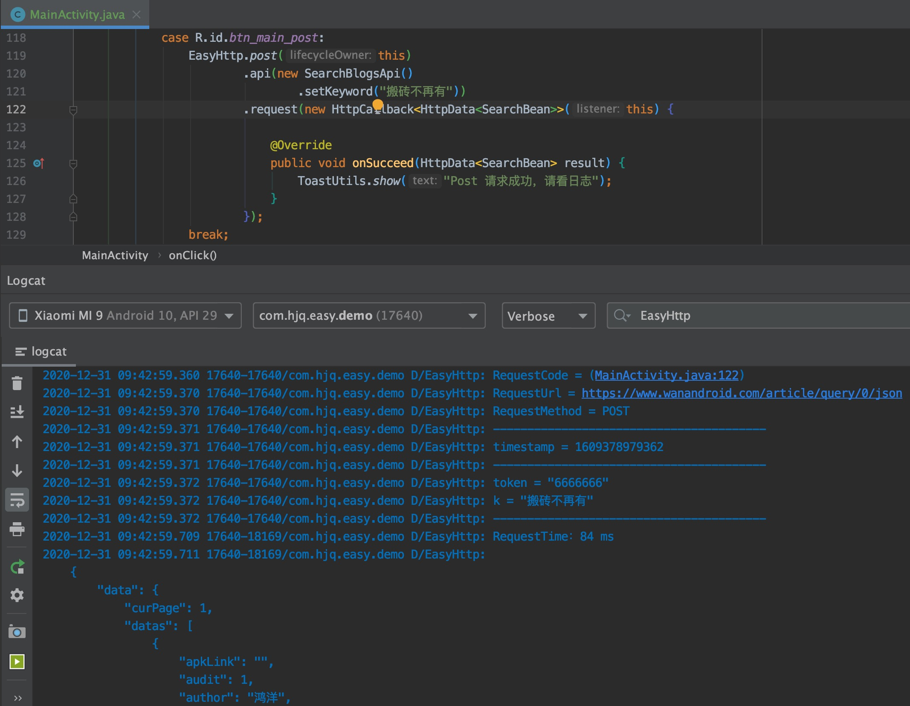

# 简单易用的网络框架

* 码云地址：[Gitee](https://gitee.com/getActivity/EasyHttp)

* 博客地址：[网络请求，如斯优雅](https://www.jianshu.com/p/93cd59dec002)

* [点击此处下载Demo](EasyHttp.apk)


* 另外对 OkHttp 原理感兴趣的同学推荐你看以下源码分析文章

 * [OkHttp 精讲：拦截器执行原理](https://www.jianshu.com/p/e0f324fd9411)

 * [OkHttp 精讲：RetryAndFollowUpInterceptor](https://www.jianshu.com/p/40636d32cb67)

 * [OkHttp 精讲：BridgeInterceptor](https://www.jianshu.com/p/fab2d74de900)

 * [OkHttp 精讲：CacheInterceptor](https://www.jianshu.com/p/44fad764c0ae)

 * [OkHttp 精讲：ConnectInterceptor](https://www.jianshu.com/p/a3a774fdff4f)

 * [OkHttp 精讲：CallServerInterceptor](https://www.jianshu.com/p/aa77af6251ff)

#### Gradle 集成

```groovy
android {
    // 支持 JDK 1.8
    compileOptions {
        targetCompatibility JavaVersion.VERSION_1_8
        sourceCompatibility JavaVersion.VERSION_1_8
    }
}

dependencies {
    // 网络请求框架：https://github.com/getActivity/EasyHttp
    implementation 'com.hjq:http:9.0'
    // OkHttp 框架：https://github.com/square/okhttp
    // noinspection GradleDependency
    implementation 'com.squareup.okhttp3:okhttp:3.12.12'
}
```
            
## [框架的具体用法请点击这里查看](HelpDoc.md)

### 不同网络请求框架之间的对比

|  功能或细节  | [EasyHttp](https://github.com/getActivity/EasyHttp) | [Retrofit](https://github.com/square/retrofit) | [OkGo](https://github.com/jeasonlzy/okhttp-OkGo) |
| :----: | :------: |  :-----: |  :-----: |
|    对应版本  |  9.0 |  2.9.0  |  3.0.4    |
|    **aar 包大小**  |  [61 KB](https://bintray.com/getactivity/maven/http#files/com/hjq/http)  | [123 KB](https://bintray.com/bintray/jcenter/com.squareup.retrofit2%3Aretrofit#files)  |  [131 KB](https://bintray.com/jeasonlzy/maven/okgo#files/com/lzy/net/okgo)  |
|    minSdk 要求  |  API 14+ |  API 21+  |  API 14+   |
|    配置多域名  |  支持  |  不支持  |   支持   |
|    **动态 Host**  |  支持  |  不支持  |   不支持   |
|    全局参数   |  支持  |  不支持  |    支持   |
|    超时重试   |  支持  |  不支持  |    支持   |
|    **下载校验**   |  支持  |  不支持  |   不支持  |
|    **极速下载**   |  支持  |  不支持  |   不支持  |
|    上传文件类型   | File / InputStream / RequestBody | RequestBody |  File  |
|    批量上传文件   |  支持  |   不支持   |    支持    |
|    上传进度监听   |  支持  |   不支持   |    支持    |
|    Json 参数提交  |  支持  |   不支持   |    支持   |
|    **请求代码定位**   |  支持  |   不支持   |    不支持    |
|    **请求生命周期**  | 自动管控 |   需要封装  |   需要封装  |
|    参数传值方式  |  字段名 + 字段值  | 参数名 + 参数值 |  定义 Key + Value  |
|    参数灵活性  | 不强制传入 | 强制全部传入 |   不强制传入 |
|    框架学习成本   |    中    |     高    |    低    |
|    **API 记忆成本**  |    低    |     高    |    低    | 
|    **接口维护成本**   |   低     |     中    |    高    |
|    框架维护状态   |  维护中  |   维护中   |   停止维护  |

* Retrofit 在我看来并不是那么好用，因为很多常用的功能实现起来比较麻烦，动态 Host 要写拦截器，日志打印要写拦截器，就连最常用的添加全局参数也要写拦截器，一个拦截器意味着要写很多代码，如果写得不够严谨还有可能出现 Bug，从而影响整个 OkHttp 请求流程，我经常在想这些功能能不能都用一句代码搞定，因为我觉得这些功能是设计框架的时候本应该考虑的，这便是我做这个框架的初心。

* 本框架采用了 OOP 思想，一个请求代表一个对象，通过类的继承和实现的特性来实现接口的动态化配置，几乎涵盖接口开发中所有的功能，使用起来非常简单灵活。

* 有很多人觉得写一个接口类很麻烦，这个点确实有点麻烦，但是这块的付出是有收获的，从前期开发的效率考虑：OkGo > EasyHttp > Retrofit，但是从后期维护的效率考虑：EasyHttp > Retrofit > OkGo，之所以比较这三个框架，是因为框架的设计思想不同，但是我始终认为 EasyHttp 才是最好的设计，所以我创造了它。

* 前期开发和后期维护哪个更重要？我觉得都重要，但是如果两者之间存在利益冲突，我会毫不犹豫地选择后期维护，因为前期开发占据的是小头，后期的持续维护才是大头。

#### 极速下载功能介绍

* 其实本质上面和极速秒传的原理是差不多的，只不过一个是上传，另一个是下载。而极速上传是将本地文件的 MD5 值和服务器上面的进行比对，如果服务器存在这个 MD5 值的文件，就将这份文件映射一份到这个用户的网盘上面，从而达到了极速秒传的效果。而极速下载也是同理，根据后台给的文件 MD5 值和本地文件进行对比，如果存在这个文件并且 MD5 值一致，证明这个文件和服务器上面的文件是一致的，那么就直接跳过下载，直接回调下载成功监听。

* 极速秒传和极速下载两者相同的共同点就是，利用缓存来达到极速的效果，只不过一者通过的是服务器的缓存，另一者使用的是本地的缓存，这两者都有一个共同的特点，就是减少服务器的压力，节省用户的等待时间。

#### 代码定位功能介绍

* 框架会在日志打印中输出在网络请求的代码位置，这样开发者可以直接通过点击 Log 来定位代码是在哪个类哪行代码，这样可以极大提升我们排查问题的效率，特别是在请求一多且业务复杂的情况下，我相信没有一个人会拒绝这样的功能。



#### 作者的其他开源项目

* 安卓技术中台：[AndroidProject](https://github.com/getActivity/AndroidProject)

* 权限框架：[XXPermissions](https://github.com/getActivity/XXPermissions)

* 吐司框架：[ToastUtils](https://github.com/getActivity/ToastUtils)

* 标题栏框架：[TitleBar](https://github.com/getActivity/TitleBar)

* 国际化框架：[MultiLanguages](https://github.com/getActivity/MultiLanguages)

* 悬浮窗框架：[XToast](https://github.com/getActivity/XToast)

* 日志框架：[Logcat](https://github.com/getActivity/Logcat)

* Gson 解析容错：[GsonFactory](https://github.com/getActivity/GsonFactory)

#### Android技术讨论Q群：78797078

#### 如果您觉得我的开源库帮你节省了大量的开发时间，请扫描下方的二维码随意打赏，要是能打赏个 10.24 :monkey_face:就太:thumbsup:了。您的支持将鼓励我继续创作:octocat:

 

#### [点击查看捐赠列表](https://github.com/getActivity/Donate)

#### 特别感谢

[张鸿洋](https://github.com/hongyangAndroid)

[WanAndroid](https://www.wanandroid.com/)

## License

```text
Copyright 2019 Huang JinQun

Licensed under the Apache License, Version 2.0 (the "License");
you may not use this file except in compliance with the License.
You may obtain a copy of the License at

   http://www.apache.org/licenses/LICENSE-2.0

Unless required by applicable law or agreed to in writing, software
distributed under the License is distributed on an "AS IS" BASIS,
WITHOUT WARRANTIES OR CONDITIONS OF ANY KIND, either express or implied.
See the License for the specific language governing permissions and
limitations under the License.
```