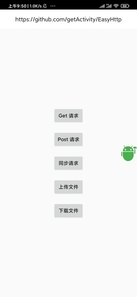

# 网络请求框架



[点击此处下载Demo](https://raw.githubusercontent.com/getActivity/ToastUtils/master/EasyHttp.apk)

#### 集成步骤

    dependencies {
        implementation 'com.hjq:http:2.0'
	    implementation 'com.squareup.okhttp3:okhttp:3.12.1'
	    implementation 'com.google.code.gson:gson:2.8.5'
    }

#### 配置权限

    <!-- 联网权限 -->
    <uses-permission android:name="android.permission.INTERNET" />

    <!-- 访问网络状态 -->
    <uses-permission android:name="android.permission.ACCESS_NETWORK_STATE" />
    <uses-permission android:name="android.permission.ACCESS_WIFI_STATE" />

    <!-- 外部存储读写权限 -->
    <uses-permission android:name="android.permission.READ_EXTERNAL_STORAGE" />
    <uses-permission android:name="android.permission.WRITE_EXTERNAL_STORAGE" />

#### 配置主机

	public class RequestServer implements IRequestServer {
	
	    @Override
	    public String getHost() {
	        return "https://www.baidu.com";
	    }
	
	    @Override
	    public String getPath() {
	        return "/api/";
	    }
	}

#### 初始化

> 需要配置请求处理，具体封装可以参考： [RequestHandler](https://github.com/getActivity/EasyHttp/blob/master/library/src/main/java/com/hjq/http/demo/http/model/RequestHandler.java)

    EasyConfig.with(new OkHttpClient())
            // 是否打印日志
            .setLog(BuildConfig.DEBUG)
            // 设置服务器配置
            .setServer(server)
            // 设置请求处理策略
            .setHandler(new RequestHandler())
            // 添加全局请求参数
            //.addParam("token", "6666666")
            // 添加全局请求头
            //.addHeader("time", "20191030")
            .into();

#### 配置接口

	public class LoginApi implements IRequestApi {
	
	    /** 用户名 */
	    private String userName;
	    
	    /** 登录密码 */
	    private String password;
	
	    @Override
	    public String getApi() {
	        return "user/login";
	    }
	
	    public LoginApi setUserName(String userName) {
	        this.userName = userName;
	        return this;
	    }
	
	    public LoginApi setPassword(String password) {
	        this.password = password;
	        return this;
	    }
	}

* 可为这个类的字段加上一些注解

	* @HttpHeader：标记这个字段是一个请求头参数
	
	* @HttpIgnore：标记这个字段不会被发送给后台
	
	* @HttpRename：重新定义这个字段发送给后台的参数名称

* 可为这个类多实现一些接口

	* implements IRequestHost：实现这个接口之后可以重新指定这个请求的主机地址

	* implements IRequestPath：实现这个接口之后可以重新指定这个请求的接口路径

#### Get 请求

    EasyHttp.get(this)
            .api(new LoginApi()
                    .setUserName("Android 轮子哥")
                    .setPassword("123456"))
            .request(new OnHttpListener<HttpData<LoginBean>>() {

                @Override
                public void onSucceed(HttpData<LoginBean> data) {
                    ToastUtils.show("登录成功");
                }

                @Override
                public void onFail(Exception e) {}
            });

#### Post 请求

    EasyHttp.post(this)
            .api(new LoginApi()
                    .setUserName("Android 轮子哥")
                    .setPassword("123456"))
            .request(new OnHttpListener<HttpData<LoginBean>>() {

                @Override
                public void onSucceed(HttpData<LoginBean> data) {
                    ToastUtils.show("登录成功");
                }

                @Override
                public void onFail(Exception e) {}
            });

#### 下载文件

> 下载缓存策略：在指定下载文件 md5 或者后台有返回 md5 的情况下，下载框架默认开启下载缓存模式，如果这个文件已经存在手机中，并且经过 md5 校验文件完整，框架就不会重复下载，而是直接回调下载监听。减轻服务器压力，减少用户等待时间。

    EasyHttp.download(this)
            .method(HttpMethod.GET)
            .file(new File(Environment.getExternalStorageDirectory(), "手机QQ.apk"))
            .url("https://qd.myapp.com/myapp/qqteam/AndroidQQ/mobileqq_android.apk")
            .md5("47CBDF2A2940B7773DD1B63CBCFD86E1")
            //.url("http://dldir1.qq.com/weixin/android/weixin708android1540.apk")
            .listener(new OnDownloadListener() {

                @Override
                public void onDownloadStart(DownloadTask task) {
                    mProgressBar.setVisibility(View.VISIBLE);
                    ToastUtils.show("下载开始：" + task.getFile().getName());
                }

                @Override
                public void onDownloadProgress(DownloadTask task) {
                    mProgressBar.setProgress(task.getProgress());
                }

                @Override
                public void onDownloadComplete(DownloadTask task) {
                    mProgressBar.setVisibility(View.GONE);
                    ToastUtils.show("下载完成：" + task.getFile().getPath());
                }

                @Override
                public void onDownloadError(DownloadTask task, Exception e) {
                    mProgressBar.setVisibility(View.GONE);
                    ToastUtils.show("下载出错：" + e.getMessage());
                }

            }).start();

#### 生命周期管理

> EasyHttp 默认不管理请求生命周期，需要在基类中进行取消与之关联的网络请求，这里只演示 BaseActivity，其他基类方式雷同。

	public class BaseActivity extends AppCompatActivity {
	
	    @Override
	    protected void onDestroy() {
	        EasyHttp.cancel(this);
	        super.onDestroy();
	    }
	}

#### 关于 Http 明文请求

> Android P 限制了明文流量的网络请求，非加密的流量请求都会被系统禁止掉。
如果当前应用的请求是 htttp 请求，而非 https ,这样就会导系统禁止当前应用进行该请求，如果 WebView 的 url 用 http 协议，同样会出现加载失败，https 不受影响

> 在 res 下新建一个 xml 目录，然后创建一个名为：network_security_config.xml 文件 ，该文件内容如下

	<?xml version="1.0" encoding="utf-8"?>
	<network-security-config>
	    <base-config cleartextTrafficPermitted="true" />
	</network-security-config>

> 然后在 AndroidManifest.xml application 标签内应用上面的xml配置

	<application
	    android:networkSecurityConfig="@xml/network_security_config" />

#### 混淆规则
	
	# OkHttp3
	-keepattributes Signature
	-keepattributes *Annotation*
	-keep class okhttp3.** { *; }
	-keep interface okhttp3.** { *; }
	-dontwarn okhttp3.**
	-dontwarn okio.**
	
	# 保护 IRequestApi 类字段名不被混淆
	-keepclassmembernames class * implements com.hjq.http.config.IRequestApi {
	    <fields>;
	}
	# 保护 Bean 类不被混淆（请注意修改包名路径）
	-keepclassmembernames class xxx.xxx.xxx.xxx.xxx.response.** {
	    <fields>;
	}
	# 保护模型类的字段不被混淆（请注意修改包名路径）
	-keepclassmembernames class xxx.xxx.xxx.xxx.xxx.xxx.HttpData {
	    <fields>;
	}

#### 作者的其他开源项目

* 架构工程：[AndroidProject](https://github.com/getActivity/AndroidProject)

* 吐司框架：[ToastUtils](https://github.com/getActivity/ToastUtils)

* 权限框架：[XXPermissions](https://github.com/getActivity/XXPermissions)

* 标题栏框架：[TitleBar](https://github.com/getActivity/TitleBar)

* 国际化框架：[MultiLanguages](https://github.com/getActivity/MultiLanguages)

* 悬浮窗框架：[XToast](https://github.com/getActivity/XToast)

#### Android技术讨论Q群：78797078

#### 如果您觉得我的开源库帮你节省了大量的开发时间，请扫描下方的二维码随意打赏，要是能打赏个 10.24 :monkey_face:就太:thumbsup:了。您的支持将鼓励我继续创作:octocat:

 

#### [点击查看捐赠列表](https://github.com/getActivity/Donate)

## License

```text
Copyright 2019 Huang JinQun

Licensed under the Apache License, Version 2.0 (the "License");
you may not use this file except in compliance with the License.
You may obtain a copy of the License at

   http://www.apache.org/licenses/LICENSE-2.0

Unless required by applicable law or agreed to in writing, software
distributed under the License is distributed on an "AS IS" BASIS,
WITHOUT WARRANTIES OR CONDITIONS OF ANY KIND, either express or implied.
See the License for the specific language governing permissions and
limitations under the License.